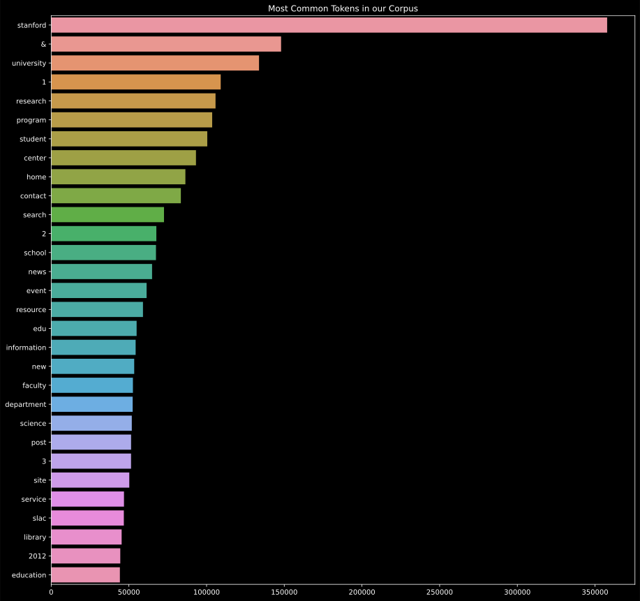
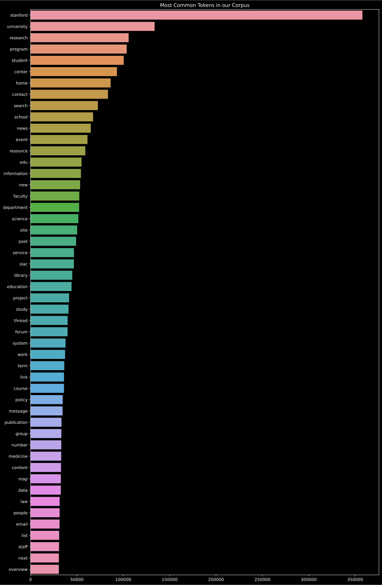
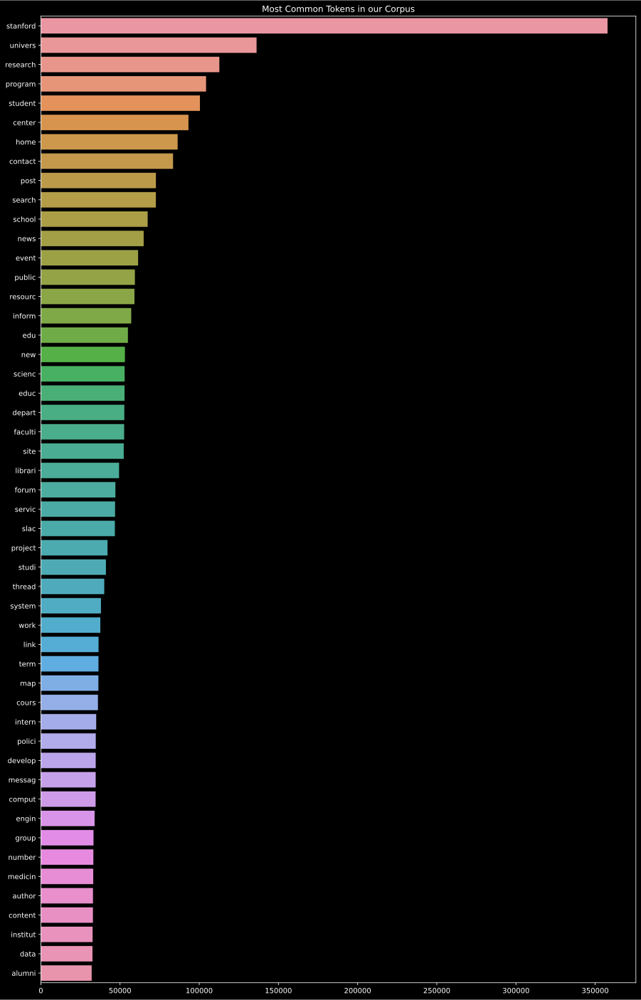

# Processing analysis

## Introduction

**Goals :**

With this analysis we take a deeper look at the preprocessing part of our application. The objective is to find a preprocessing chain that reduces the vocabulary to a minima by removing the tokens that are the less likely to appear in a user query, but also remove the words that are too common to carry specific information about the text. 

The three main steps of the preprocessing step are the tokenization, the stop words removal and the lemmatization/stemming. the stopwords removal usually contributes largely to the diminution of the corpus size, by removing very common words, while the lemmatization contributes more to the vocabulary size reduction by finding common roots of related words.

**Main results :**

Our first approach used pos tagging to perform lemmatization and a very complete list of stop words in the english language. However when analysing the most frequent words in the corpus produced by this preprocessing chain, we saw that a lot of tokens were not filtered properly (special caracters, numbers, extensions, etc...). We then added a filtering step and updated the list of stop words with common file extensions. We then tried a different stemming approach to speed up our algorithm and compared the given corpus with previous results.

## Detailed analysis


### Vocabulary and token count

Using the pos tagging lemmatization the corpus was processed in about 24 mins :

```
    removing stop words: 100%|██████████| 98998/98998 [01:53<00:00, 875.41it/s]
    lemmatizing collection : 100%|██████████| 98998/98998 [21:36<00:00, 76.36it/s]
```

Then we checked the influence of our operations on the corpus size and the vocabulary size :

```
token count : 
    initial : 25498340 
    without stopwords : 17726739 
    after lemmatization : 17726739

vocabulary size : 
    initial : 347071 
    without stp : 346731 
    after lemmatization : 336509
```

With that first approach we obtained a reduction of about 30% of the corpus size, however, we can see that the vocabulary stayed rather big after this first operation. 


### Most frequent words

Here we check the most frequent words we got from our preprocessing operations, in order to make adjustments to our stop words file :





Some special cases, like numbers, acronyms or special caracters seem to have passed the initial stop words removal. From this analysis we added a filtering approach to remove numbers and special caracters, and updated our stopwords list.

Apply these additional treatments led to the following results :

```
token count : 
    initial : 25498340 
    without stp : 17681627 
    filtered : 15785463 
    after lemmatization : 15617820

vocabulary size : 
    initial : 347071 
    without stp : 346717 
    filtered : 277807 
    after lemmatization : 267481
```



The filtering show that the numbers and special characters were a good part of the vocabulary. However, the size of the vocabulary is still big compared to the reduction that was achieved with lemmatization. 


### Speed concerns

In our first version of the program, we used Part-Of-Speach tagging to find the proper lemmatization for each token. However, this is really time consuming, as the lemmatization process is the slowest in our preprocessing chain. For faster preprocessing, we used the snowball stemmer alone which has remarkable results in itself. The following results using that stemmer have been computed in about 7 mins :





```

token count : 
    initial : 25498340 
    without stp : 17681627 
    filtered : 15785463 
    after lemmatization : 15634214

vocabulary size : 
    initial : 347071 
    without stp : 346717 
    filtered : 277807 
    after lemmatization : 237712

```

### Low occurence analysis

By counting the number of unique terms with low occurences in the corpus, we can see that the vast majority of the words in the corpus only occur a handfull of times, looking up some words that only occured once we found out that there were a lot of typos or references in the corpus, leading the majority of the words being very rare. As these words are very unlikely to appear in a user query, we could diminish the size of the index by removing the words with the lowest occurences.


Using the previous results, we can see that 84 % of the vocabulary occur less than 10 times. which shows that the stemming actually reduced quite efficiently the vocabulary among words occuring more regularly. 

