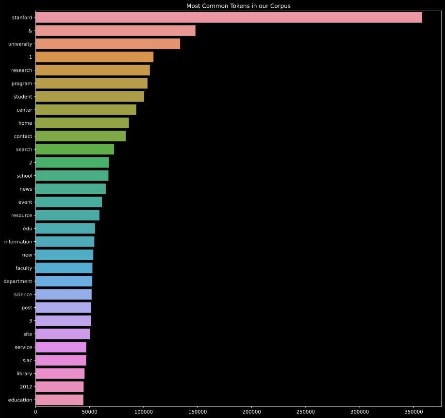
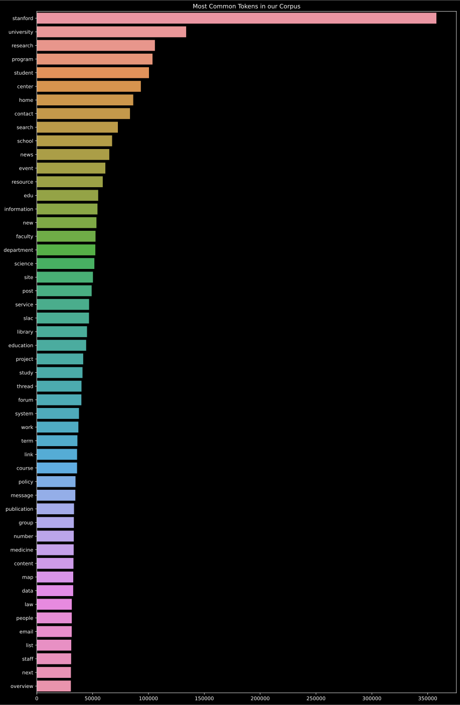
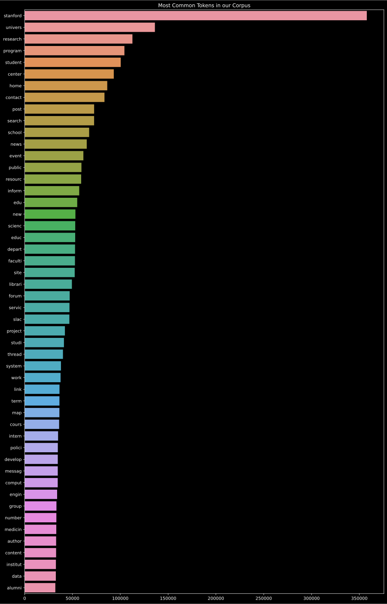
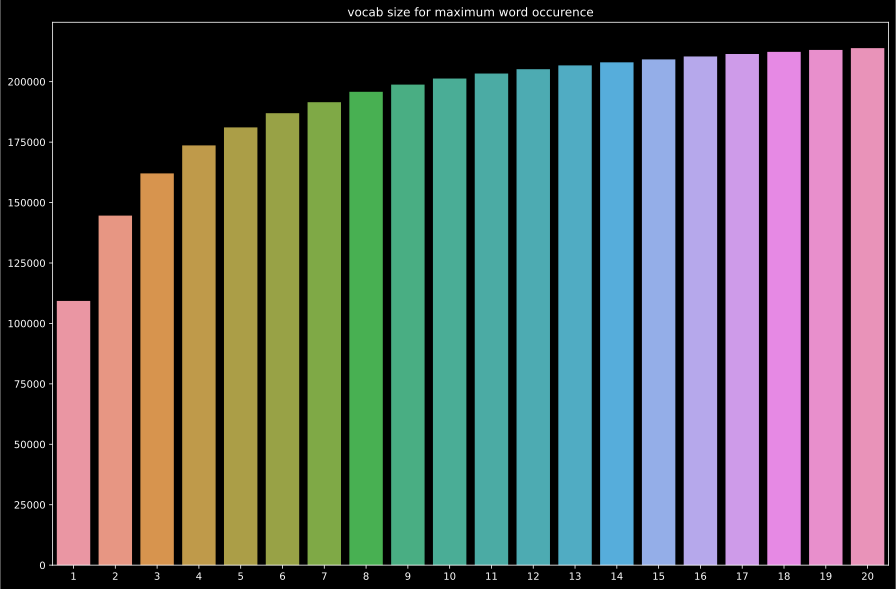

# RI project - Search engine on the Stanford collection

A search engine project using the collection provided by Stanford for their online course : Information Retrieval and Web Search (cs276).
A link to the course can be found [here](http://web.stanford.edu/class/cs276/), and the collection can be downloaded by following this [link](http://web.stanford.edu/class/cs276/pa/pa1-data.zip).

The goal of this project, which is developped for the **Information Research for the Web** course, is to build a small search engine around the CS276 dataset. More specifically, it must construct an inverted index from the dataset, in order to be able to respond at queries on this database. We support two types of queries:

- boolean queries: cats OR (dogs AND duck)
- vectorial queries: cats dogs duck

The performance bottlenecks are important to monitor since the goal of this course is also to observe the challenges of the real scale of the web.

## Setup

We're using **Python 3.7+**, with some of the last data structures implemented (`dataclasses`).

As the dataset is heavy, it is not included in the repositery. Therefore, download the [collection](http://web.stanford.edu/class/cs276/pa/pa1-data.zip) and extract it in the `data` directory, under a `collection directory` :

```bash
.
├── data
│   └── collection
|       ├── 0
|       ├── ...
|       └── 9
├── preprocess.py
...
```

**Caution:** We assume you're in a correct new *Virtual Environnement*, with `python` and `pip` refering to Python 3.7+.

To install the modules, you can simply run `make install`.

Or Install the necessary modules : `pip install -r requirements.txt`, and the minimal *nltk* modules : `python -m nltk.downloader popular`.

We specifically relie on two modules for this project :

- `nltk`, a natural language processing toolkit, used for tokenization and lemmatization. We use *wordnet*, so you'll need to download additional data.
- `ttable`, a library to work with Boolean expressionss

## Usage

TODO, with interface.py

## Preprocessing

### Files loading

We simply open all files in the `collection` folder, loading the content in memory into a dictionnary.

Since there is almost 100 000 documents, it takes aroud **15 sec** to load all the files. To avoid waiting for this operation, we save the corpus once fully loaded as a binary with `pickle` at `data/corpus.pkl`. This file takes only *161 Mo* and is loaded in **0.38 sec**.

### Tokenization

The data set is already tokenized, but we still this process for queries.
We use the tokenization provided with `nltk`, which is more precise than a simple `split` on spaces, for numbers or `'s` for example.

### Stop words

We remove stop words before *lemmatization* but also after. The idea is that we want to remove all obvious useless words from the dataset before the quite *costly* lemmatization, but also remove some synonyms of stop words find with the *lemmatization*. Since the stop word removal is quite negligeable in term of computing time for the whole index creation, we think it's not a bad choice.

### Lemmatization

For a better quality of lemmatization, we use the *context* of a token in a sentence, with the `pos_tag` (*Part-Of-Speach* tag) function in `nltk`, which can indicate the grammatical use of a word : *fly* can be either a verb or a noun. The *WordNet* lemmatizer can take as argument this categorisation to give a precise result.

However, since this process quite is long, so we also used the simpler version with the `SnowballStemmer` from `nltk`, which is faster.

### Inversed index construction

Building the inversed index consist on applying these differents steps to the whole collection, and then iterate over all documents and tokens, counting and storing the index in a dictionnary.

We support three index types:

- *document index*: For each term of the collection, it returns the ids of the documents in which the term appears.

```python
{"information": [1, 4]} # the term 'information' appears in docs 1 and 4
```

- *frequency index*: For each term of the collection, for each document in which the term appears, it returns both the id of the document and the term frequency of the term in the document.

```python
{"information": {1: 2, 4: 19}} # the term 'information' appears in docs 1 (2 times) and 4 (19 times)
```

- *position index*, For each term of the collection, for each document in which the term appears, it returns both the id of the document and the positions of the term in the document.

```python
{"information": {1: [1, 19], 4: [0, 2, 5]}} # the term 'information' appears in docs 1 (at position 1 and 19) and 4 (at position at 0, 2 and 5)
```

To create an index, a cli is provided with `[src/preprocess.py](src/preprocess.py)` :

```bash
> python src/preprocess.py --help
usage: preprocess.py [-h] [--pos POS] index_type output

positional arguments:
  index_type  type of the index to build
  output      path where the index will be saved

optional arguments:
  -h, --help  show this help message and exit
  --pos POS   use the the Part-Of-Speech (pos) lemmatization, or simple
              stemmer (default=True)
```

For example to create an frequency index with the simple Snowball stemmer, saving it as a `pickle` binary, you can run `python src/preprocess.py 2 --pos False data/frequency_index_stem.pkl`.

To reduce development time, we also have an environment variable for a `DEV` flag, which load less files from the corpus : `DEV=1 DEV_ITER=100 python src/preprocess.py 1`. By default, the index is saved in the `data` folder as `index.pkl` (or `dev_index.pkl`).

### First analysis

**Note: We're doing the time benchmark on our working machines. Therefore the resuts can vary quite a lot depending of the work actually done on the computer, process launched by the OS, etc... These benchmarks are only here to give an general idea of the steps which can take some time.**

Let's benchmark a first run for our index creation, with an index of type 1, a complete lemmatization.

| *Steps*    | Corpus loading | Tokenization | Stop words | Lemmatization | Stop words | Index  | Total   |
|----------|----------------|--------------|------------|---------------|------------|--------|---------|
| *Time (s)* | 12.38          | 80           | 67         | 679           | 49         | 2069   | **2956.38** |
| *%*        | 0.42%          | 2.71%        | 2.27%      | 22.97%        | 1.66%      | 69.98% | **100.00%** |

Here we have two main *bottlenecks**. In the preprocessing part, we have the *lemmatization* which takes several minutes, and then the index construction is very long. Let's try to improve this two parts : processing and indexing.

## Processing analysis

### Introduction

#### Goals

With this analysis we take a deeper look at the preprocessing part of our application. The objective is to find a preprocessing chain that reduces the vocabulary to a minima by removing the tokens that are the less likely to appear in a user query, but also remove the words that are too common to carry specific information about the text.

The three main steps of the preprocessing step are the tokenization, the stop words removal and the lemmatization/stemming. the stopwords removal usually contributes largely to the diminution of the corpus size, by removing very common words, while the lemmatization contributes more to the vocabulary size reduction by finding common roots of related words.

#### Main results

Our first approach used pos tagging to perform lemmatization and a very complete list of stop words in the english language. However when analysing the most frequent words in the corpus produced by this preprocessing chain, we saw that a lot of tokens were not filtered properly (special caracters, numbers, extensions, etc...). We then added a filtering step and updated the list of stop words with common file extensions. We then tried a different stemming approach to speed up our algorithm and compared the given corpus with previous results.

### Vocabulary and token count

Using the pos tagging lemmatization the corpus was processed in about 24 mins :

```bash
    removing stop words: 100%|██████████| 98998/98998 [01:53<00:00, 875.41it/s]
    lemmatizing collection : 100%|██████████| 98998/98998 [21:36<00:00, 76.36it/s]
```

Then we checked the influence of our operations on the corpus size and the vocabulary size :

```bash
token count :
    initial : 25498340
    without stopwords : 17726739
    after lemmatization : 17726739

vocabulary size :
    initial : 347071
    without stp : 346731
    after lemmatization : 336509
```

With that first approach we obtained a reduction of about **30%** of the corpus size, however, we can see that the vocabulary stayed rather big after this first operation.

Note that removing stop words after the *lemmatization* removes only around **1%** of the tokens count after lemmatization. Therefore, altough it is still useful, the impact if very small.

### Most frequent words

Here we check the most frequent words we got from our preprocessing operations, in order to make adjustments to our stop words file :



Some special cases, like numbers, acronyms or special caracters seem to have passed the initial stop words removal. From this analysis we added a filtering approach to remove numbers and special caracters, and updated our stopwords list.

Apply these additional treatments led to the following results :

```bash
token count :
    initial : 25498340
    without stp : 17681627
    filtered : 15785463
    after lemmatization : 15617820

vocabulary size :
    initial : 347071
    without stp : 346717
    filtered : 277807
    after lemmatization : 267481
```



The filtering show that the numbers and special characters were a good part of the vocabulary. However, the size of the vocabulary is still big compared to the reduction that was achieved with lemmatization.

### Speed concerns

In our first version of the program, we used Part-Of-Speach tagging to find the proper lemmatization for each token. However, this is really time consuming, as the lemmatization process is the slowest in our preprocessing chain. For faster preprocessing, we used the snowball stemmer alone which has remarkable results in itself. The following results using that stemmer have been computed in about *7 mins* instead of *20 mins* :



```bash

token count : 
    initial : 25498340 
    without stp : 17681627 
    filtered : 15785463 
    after lemmatization : 15634214

vocabulary size : 
    initial : 347071 
    without stp : 346717 
    filtered : 277807 
    after lemmatization : 237712
```

### Low occurence analysis

By counting the number of unique terms with low occurences in the corpus, we can see that the vast majority of the words in the corpus only occur a handfull of times, looking up some words that only occured once we found out that there were a lot of typos or references in the corpus, leading the majority of the words being very rare. As these words are very unlikely to appear in a user query, we could diminish the size of the index by removing the words with the lowest occurences.



Using the previous results, we can see that 84% of the vocabulary occur less than 10 times. which shows that the stemming actually reduced quite efficiently the vocabulary among words occuring more regularly.

## Index Construction

Now that's the pre-processing is optimized, how can we improve the index construction.

### It's Easier to Ask for Forgiveness than Permission

A first idea was inspired by the **Python** documentation itself, which mention **[EAFP](https://docs.python.org/3/glossary.html?highlight=eafp#term-eafp)** : *Easier to Ask for Forgiveness than Permission*. Indeed, in our process we use some `if term in index` before inserting or updating the current index, which is a dictionnary. The idea is that it might be faster to try to update the dictionnary, without checking if the key already exists, and catch the exception if it occurs.

For example, for the *frequency* index. Instead of

```python
for term in collection[document]:
    if term in index:
        if doc_id in index[term]:
            index[term][doc_id] += 1
        else:
            index[term][doc_id]= 1
    else:
        index[term]=OrderedDict()
        index[term][doc_id]=1
```

do

```python
for term in collection[document]:
    try:
        try:
            index[term][doc_id] += 1
        except KeyError:
            index[term][doc_id]= 1
    except KeyError:
        index[term]=OrderedDict()
        index[term][doc_id]=1
```

With the original method, it takes around **909** sec for the `if/in` solultion and **882** sec for the `try/catch` : not very concluant, this small difference is not significant.

If we look at the **[Python Source code](https://hg.python.org/cpython/file/52f68c95e025/Objects/dictobject.c#l296)** for the dictionnary, we can look at the method `__contains__`, whis is called with the `in` operator, and also the method `__get__` that we use in the `try/catch`. And we can observe that it reuses the same code part : there is no improvement to except in using the `try/catch` method, except being somewhat more *pythonic*.

### Data Sructures

We didn't improve our index construction with this, however we can observe an interesting difference between the *simple* inverted index, which only save the presence of a term in a document, and the *frequency* index which also count how many of these terms we have in the document. It appears the first index is way longer to build, the number of opperations per seconds decreasing during the construction (with the *Stemmer*, so a smaller vocabulary) :

```bash
building index : 100%|█████████████████████████████████████████████| 98998/98998 [21:29<00:00, 76.78it/s]
```

The problem comes from the use of a list :

```python
try:
    if doc_id not in index[term]:
        index[term].append(doc_id)
except KeyError:
    index[term] = [doc_id]
```

The cost of `doc_id not in index[term]` is *O(n)*. The idea here is to use a dictionnary, from which we can call the `values())` method to obtain the same list.

```python
try:
    try:
        _ = index[term][doc_id]
        # if pass, do nothing
    except KeyError:
        index[term][doc_id]=1

except KeyError:
    index[term]=OrderedDict()
    index[term][doc_id]=1
```

Now the cost of accessing `index[term][doc_id]` is only *O(1)* (see [here](https://wiki.python.org/moin/TimeComplexity)).
And we have way better performance :

```bash
building index : 100%|███████████████████████████████████████████| 98998/98998 [00:16<00:00, 5874.64it/s]
```

Here we can see the importance of using correct data structures for the algorithm.

### Conclusion of the improvements on index construction

By using a simpler stemmer, but more important by using the correct data structure, we can have raisonable execution times.

#### Simple Index with stemmer

| *Steps*    | Corpus loading | Tokenization | Stop words | Lemmatization | Stop words | Index | Stats | Total   |
|----------|----------------|--------------|------------|---------------|------------|-------|-------|---------|
| *Time (s)* | 15             | 80           | 66         | 141           | 51         | 17    | 6     | 370     |
| *%*        | 4.05%          | 21.62%       | 17.84%     | 38.11%        | 13.78%     | 4.59% |  1.62%     | 100.00% |

The index takes up *66Mo* on the disk.

#### Simple Index with Part-Of-Speach lemmatization

Here the lemmatization takes more time. The computer seemed to have more load (tokenization tooked longer)

| Steps    | Corpus loading | Tokenization | Stop words | Lemmatization | Stop words | Index | Stats | Total   |
|----------|----------------|--------------|------------|---------------|------------|-------|-------|---------|
| Time (s) | 15             | 101          | 80         | 1150          | 73         | 17    | 2     | 1436    |
| %        | 1.04%          | 7.03%        | 5.57%      | 80.08%        | 5.08%      | 1.18% | 0.14% | 100.00% |

The index takes up *68Mo* on the disk.

#### Frequency Index with stemmer

| *Steps*    | Corpus loading | Tokenization | Stop words | Lemmatization | Stop words | Index | Stats | Total   |
|----------|----------------|--------------|------------|---------------|------------|-------|-------|---------|
| *Time (s)* | 15             | 92           | 76         | 167           | 57         | 20    | 6     | 427     |
| *%*        | 3.51%          | 21.55%       | 17.80%     | 39.11%        | 13.35%     | 4.68% |  1.41%    | 100.00% |

The index takes up *66Mo* on the disk.

## Querying

### Loading the index

Since we saved the index as a `pickle` binary the loading is quite fast, around **3 sec**.

### Boolean querying

If the request is entered as *boolean*, we therefore except that it is syntactically correct. We support three logical operator :

- **AND** : `term1 AND term2` will return documents containing both `term1` or `term2`
- **OR** : `term1 AND term2` will return documents containing `term1`, `term2` or both
- **NAND** : which means **AND NOT**, `term1 NAND term2` will return documents containing `term1` but not `term2`.

You can also use *parenthesis* for a better query expression. Otherwise, by default, `ttable` has the following default priorities (or *[precedence](https://developer.mozilla.org/en-US/docs/Web/JavaScript/Reference/Operators/Operator_Precedence)*) for operators : `NAND > AND > OR`, ie `cats OR dogs NAND ducks AND squid` will be interpreted as `(cats OR ((dogs NAND ducks) AND squid))`

First, we tokenize, remove stop words and lemmatize the query, except for the *logical operators*. Then, we use `ttable` to transform the query into its *postfix syntax*, which will remove parenthesis and change the order of tokens and logical operator. It is then easy to process the query : read the postfix query sequentially. If you have a token, add the list of documents with this token (with the inverted index). Ortherwise, its a logical operator, apply a merge with this operator and the last two elements of the stack.

If you don't specify any logical operator, we assume it's an **AND** request : `cats dog duck` --> `cats AND dog AND duck`.

### Vectorial querying

Here we're making a dot product between a vector representing the query and the vector representing the dataset.

**TODO**: add a few more lines

### Practical querying

To use and execute queries, you can use the cli provided by `[src/interface.py](src/interface.py)`.

```bash
> python src/interface.py --help
usage: interface.py [-h] [--model MODEL] [--number NUMBER] query

positional arguments:
  query                 query to process

optional arguments:
  -h, --help            show this help message and exit
  --model MODEL         <boolean|vectorial> model used to process query (default="boolean")
  --number NUMBER, -n NUMBER
                        number of results to display (default=10)
```

The path to the index or the stats used for vectorial query are configured through *Environnement variable*, which can also be modified in `[src/config.py](src/config.py)`.

For example, if you want to use a custom index, for a vectorial query with a `tf_idf_log_normalize` for both query and document weights, you could run the following query :

```bash
PATH_INDEX=/my/custom/index/path WEIGHT_QUERY=tf_idf_log_normalize WEIGHT_DOCUMENT=tf_idf_log_normalize python src/interface.py --model vectorial "cats are cute"
```

Use the same *stemmer/lemmatizer* for the query that the one used for the index. You can control the use of the POS lemmatizer or the Snowball Stemmer with the `POS` env variable (True by default).

## Testing

Simply run `make test`.

These tests helped during development to avoid breaking changes, and validate Pull Request with Github Action (CI/CD).
